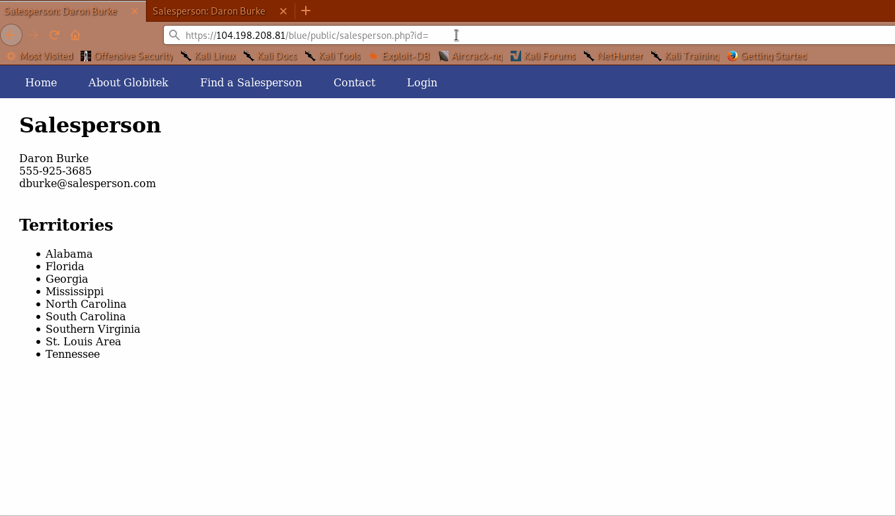
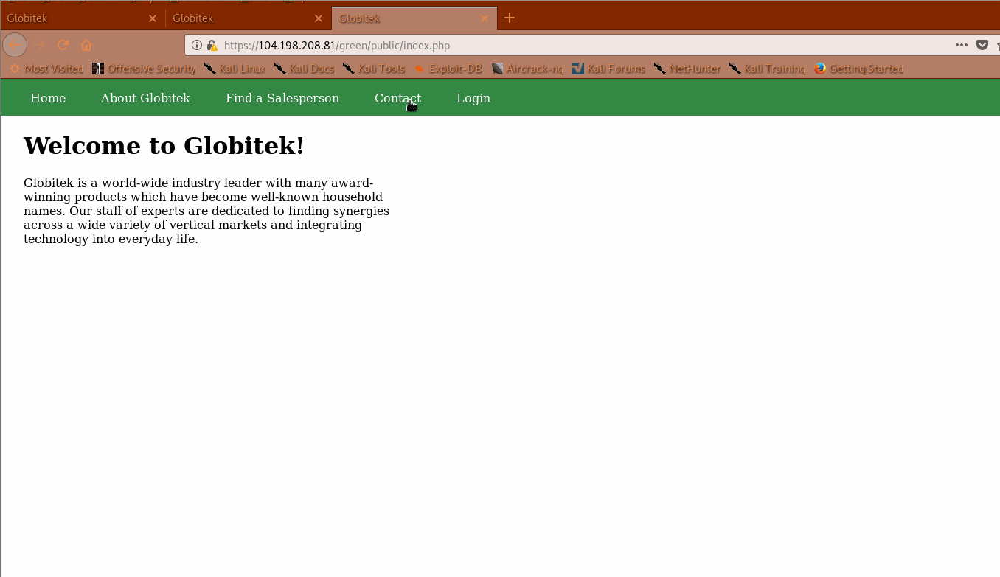
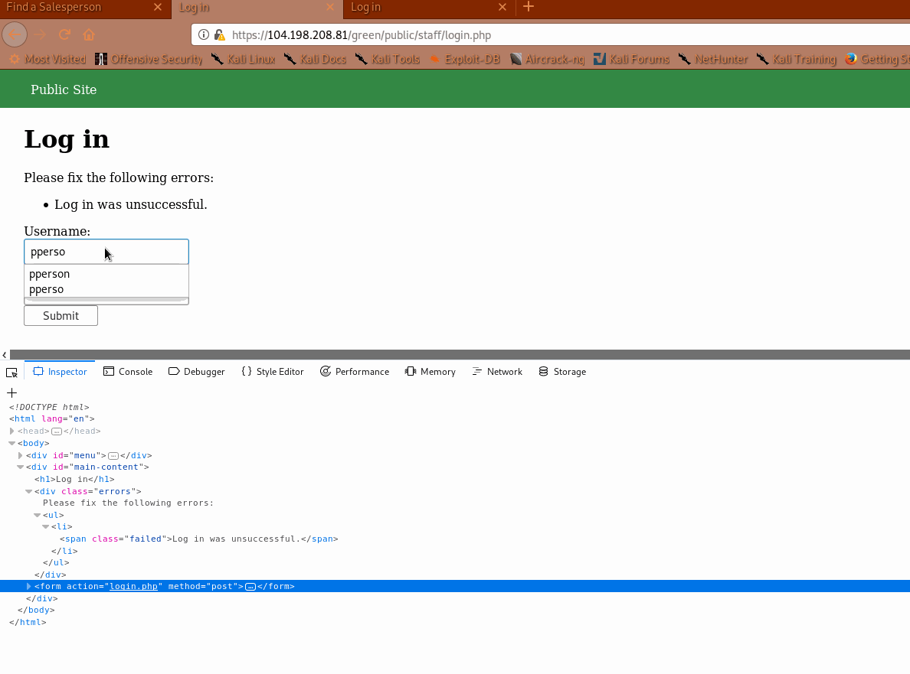
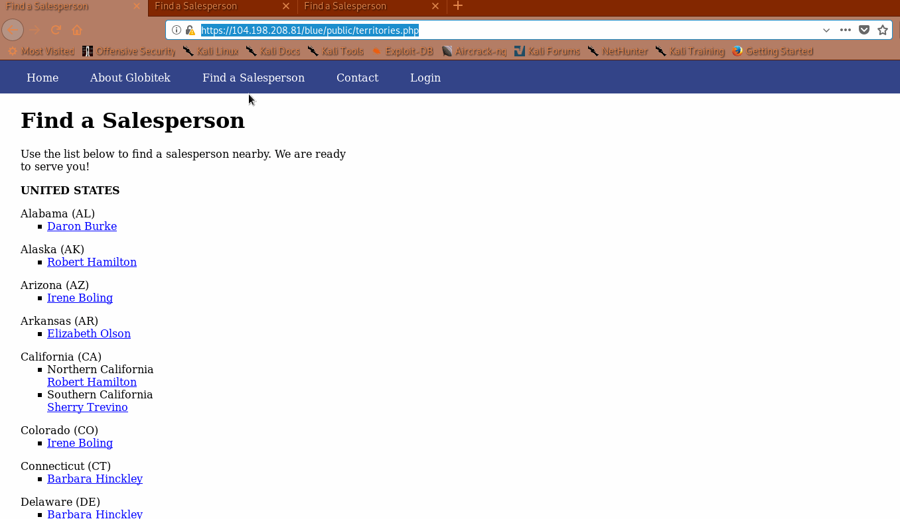

# Project 8 - Pentesting Live Targets

Time spent: 7 hours spent in total

> Objective: Identify vulnerabilities in three different versions of the Globitek website: blue, green, and red.

The six possible exploits are:
* Username Enumeration
* Insecure Direct Object Reference (IDOR)
* SQL Injection (SQLi)
* Cross-Site Scripting (XSS)
* Cross-Site Request Forgery (CSRF)
* Session Hijacking/Fixation

Each version of the site has been given two of the six vulnerabilities. (In other words, all six of the exploits should be assignable to one of the sites.)

## Blue

Vulnerability #1: SQLI - The blue site left a vulnerability in the URL.

Vulnerability #2: CSRF

## Green

Vulnerability #1: 
Finding this vulnerability was just a matter of looking in the html response. The bug happens when a user dumps a script into the form, and when the admin opens the page, it triggers. 

Vulnerability #2: Enumeration - the admin had accounted for current users, which appeared in bold if your password was off, and if you put in an invalid user, it would not be bold.

## Red

Vulnerability #1: IDOR was pretty simple to find. We could see the user from the inside. We needed to find the user from the outside.

Vulnerability #2: Someone changed the password to pperson. I'm locked out. 

## Notes

Unnumerable.

